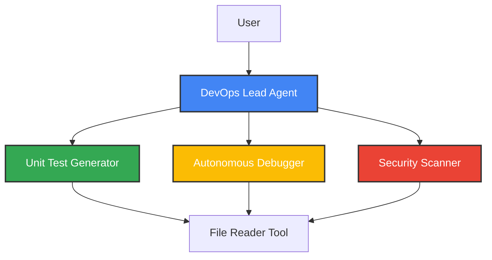

# 🤖 Automated DevOps Agent

An intelligent multi-agent system built with Google's ADK (Agent Development Kit) that automates DevOps tasks including unit test generation, debugging, and security scanning.

## 🌟 Features

- **🧪 Automated Unit Test Generation**: AI-powered test generation for Python code using pytest/unittest
- **🐛 Intelligent Debugging**: Autonomous bug analysis and fix recommendations with root cause analysis
- **🔒 Security Scanning**: OWASP Top 10 vulnerability detection and remediation suggestions
- **🎯 Smart Routing**: Root agent automatically delegates tasks to specialized sub-agents
- **🌐 Web Interface**: Interactive web-based interface powered by ADK

## 🏗️ Architecture



### Agent Hierarchy

- **DevOps Lead** (`devops_lead`): Main orchestrator that routes requests
  - **Unit Test Generator** (`unit_test_generator`): Creates comprehensive test code
  - **Autonomous Debugger** (`autonomous_debugger`): Analyzes and resolves bugs
  - **Security Scanner** (`security_scanner`): Identifies security vulnerabilities

## 🚀 Quick Start

### Prerequisites

- Python 3.8 or higher
- Google AI API key (get one at [Google AI Studio](https://aistudio.google.com/))

### Installation

1. **Clone or download this repository**

2. **Create a virtual environment** (recommended)
   ```bash
   python -m venv venv
   
   # Windows
   venv\Scripts\activate
   
   # macOS/Linux
   source venv/bin/activate
   ```

3. **Install dependencies**
   ```bash
   pip install -r requirements.txt
   ```

4. **Set up environment variables**
   ```bash
   # Copy the example environment file
   cp .env.example .env
   
   # Edit .env and add your Google API key
   # GOOGLE_API_KEY=your_actual_api_key_here
   ```

### Running the Application

```bash
python main.py
```

The server will start and display a URL (typically `http://localhost:3000` or `http://localhost:8080`). Open this URL in your browser to interact with the DevOps agents.

## 💡 Usage Examples

### Generate Unit Tests

**User**: "Generate unit tests for target_code/vulnerable_app.py"

The DevOps Lead will delegate to the Unit Test Generator, which will:
1. Read the source code using the file reader tool
2. Analyze functions and edge cases
3. Generate a complete test file with pytest or unittest

### Debug Code

**User**: "I'm getting a ZeroDivisionError in the calculate_discount function"

The DevOps Lead will delegate to the Autonomous Debugger, which will:
1. Locate the problematic code
2. Perform root cause analysis
3. Provide a fixed version with explanation

### Security Audit

**User**: "Please perform a security audit on target_code/vulnerable_app.py"

The DevOps Lead will delegate to the Security Scanner, which will:
1. Scan for common vulnerabilities (SQL injection, XSS, etc.)
2. Classify severity (High/Medium/Low)
3. Provide secure code alternatives

## 📁 Project Structure

```
automated_devops_agent/
├── devops_automator/          # Main application package
│   ├── __init__.py
│   ├── agent.py               # Root orchestrator agent
│   ├── supporting_agents.py   # Specialized sub-agents
│   └── tools.py               # Custom tools (file reader)
├── target_code/               # Example/test code for agents to analyze
│   ├── vulnerable_app.py      # Intentionally vulnerable code for testing
│   ├── test_agent.py          # Unit tests for agent routing
│   └── README.md              # Documentation for test fixtures
├── main.py                    # Application entry point
├── requirements.txt           # Python dependencies
├── .env.example               # Environment variable template
└── README.md                  # This file
```

## 🔧 Configuration

### Environment Variables

Create a `.env` file in the root directory:

```env
# Required: Your Google AI API Key
GOOGLE_API_KEY=your_api_key_here
```

### Customizing Agents

You can modify agent behavior by editing:
- **Model**: Change `MODEL_NAME` in `devops_automator/agent.py`
- **Instructions**: Update the `instruction` parameter for each agent
- **Tools**: Add new tools in `devops_automator/tools.py`

## 🧰 Development

### Running Tests

```bash
# Run agent routing tests
python target_code/test_agent.py

# Or with pytest (if installed)
pytest target_code/test_agent.py -v
```

### Adding New Agents

1. Define your agent in `devops_automator/supporting_agents.py`
2. Register it in the `sub_agents` list in `devops_automator/agent.py`
3. Update the root agent's instructions for routing logic

### Creating Custom Tools

```python
from google.adk.tools import FunctionTool

def my_custom_tool(param: str) -> str:
    """Your tool implementation"""
    return result

my_tool = FunctionTool(func=my_custom_tool)
```

## 🔒 Security Notes

- The file reader tool restricts access to the project directory only
- Never commit your `.env` file or API keys to version control
- The `target_code/vulnerable_app.py` contains intentionally insecure code for testing purposes

## 📚 Dependencies

- **google-adk**: Agent Development Kit framework
- **python-dotenv**: Environment variable management

## 🤝 Contributing

Contributions are welcome! Please see [CONTRIBUTING.md](CONTRIBUTING.md) for guidelines.

## 📄 License

This project is licensed under the MIT License - see the [LICENSE](LICENSE) file for details.

## 🆘 Troubleshooting

### "Could not import google-adk" Error

Make sure you've installed dependencies:
```bash
pip install -r requirements.txt
```

### API Key Issues

1. Verify your `.env` file exists and contains `GOOGLE_API_KEY`
2. Check that your API key is valid at [Google AI Studio](https://aistudio.google.com/)
3. Ensure `.env` is in the same directory as `main.py`

### Port Already in Use

If the default port is occupied, the ADK server will try alternative ports automatically.

## 📞 Support

For issues or questions:
1. Check the troubleshooting section above
2. Review the [ADK documentation](https://github.com/google/adk)
3. Open an issue on the project repository

---

**Built with ❤️ using Google ADK**
